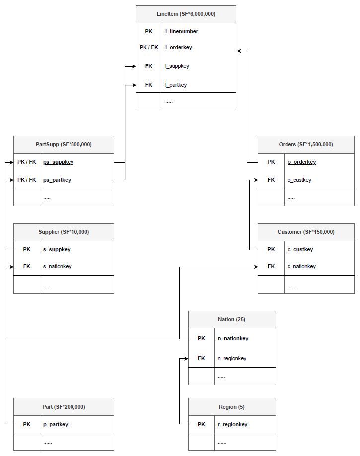

# Dataset and Experiment setup 

For the TPC-H dataset we refer to the [TPC website](https://www.tpc.org/tpch/). For convenience we have provided the SQL files for TPC-H with scaling factor 0.01 (TPC-H small) here. For other scaling factors the user would have to generate TPC-H instances and export the tables into csv format.

The image below shows the TPC-H relational database schema:

